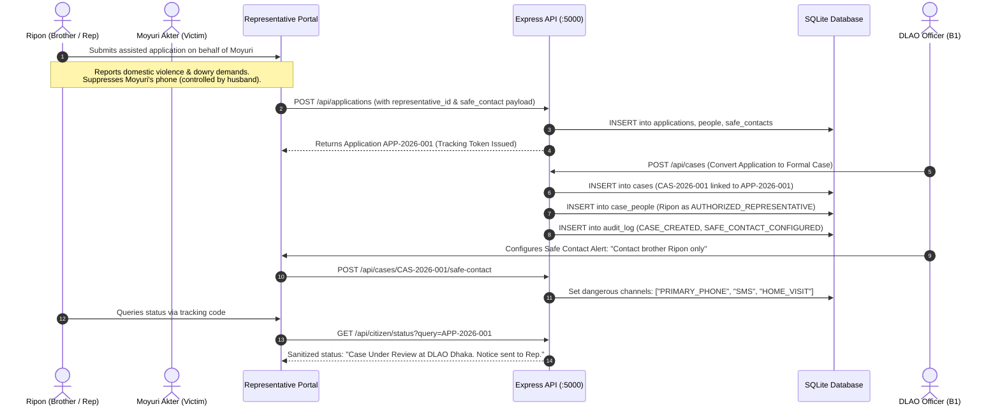
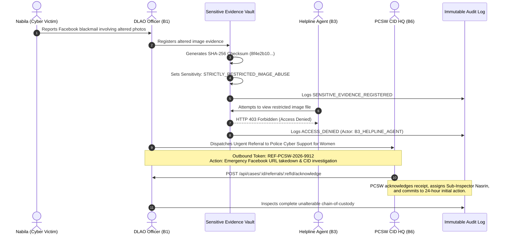
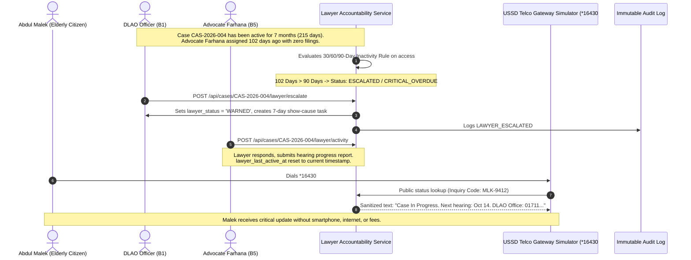
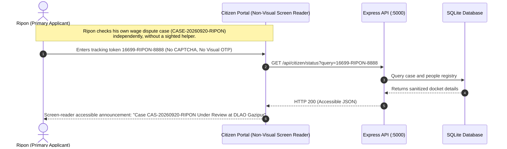
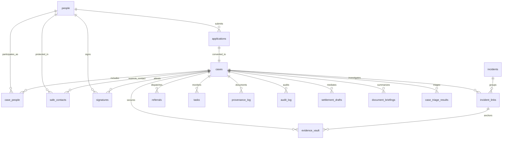
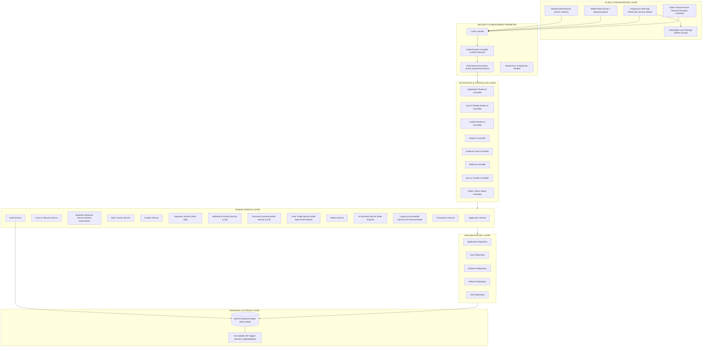

# ADLASB
## Digital Legal Aid System
### Bangladesh Digital Legal Aid & Justice Access Platform

> **ADLASB (Automated Digital Legal Aid System for Bangladesh)** is an end-to-end, privacy-hardened, and accessible public justice platform engineered to digitize legal aid operations modeled on the operational workflows of the National Legal Aid Services Organization (NLASO). Designed to dismantle geographic, linguistic, technological, and bureaucratic barriers, the system unifies grassroot intake (via Union Digital Centres, web, and simulated feature-phone channels), strict evidentiary chain-of-custody, cross-agency referrals, panel lawyer accountability, and multi-stage provenance logging into an unbroken, tamper-resistant **Golden Thread** of justice.

---

## 1. Executive Summary

### What is ADLASB?
ADLASB is an integrated digital legal aid prototype modeled on the statutory responsibilities of the National Legal Aid Services Organization (NLASO) under the Ministry of Law, Justice and Parliamentary Affairs, Bangladesh. It provides a structured, verifiable digital pathway connecting indigent citizens seeking state-funded legal assistance with District Legal Aid Offices (DLAOs), mediation boards, court-assigned panel lawyers, and external partner agencies.

### Who is it for?
1. **Marginalized & Vulnerable Citizens:** Indigent individuals, victims of domestic violence, rural residents, indigenous communities, cyber harassment victims, and citizens without smartphones or internet access.
2. **Authorized Representatives:** Trusted family members, legal guardians, or paralegals submitting applications or tracking progress on behalf of an applicant.
3. **Union Digital Centre (UDC) Entrepreneurs:** Village-level operators providing assisted, offline-capable digital government services across Bangladesh’s 4,500+ Union Parishads.
4. **Helpline Officers & DLAO Staff:** Case officers, mediators, and registry staff triaging intake, scheduling alternative dispute resolution (ADR), assigning lawyers, and managing case lifecycles.
5. **Panel Lawyers:** Bar association attorneys assigned by the government to represent legal aid recipients in court.
6. **Partner Agencies:** Specialized external bodies such as the Police Cyber Support for Women (PCSW) of CID HQ, One-Stop Crisis Centres (OCC), and Social Welfare departments.

### What problem does it solve?
In the conventional legal aid ecosystem, a citizen's journey is fragmented across handwritten paper dockets, unrecorded telephone calls, unmonitored inter-agency referrals, and unmonitored procedural delays. Victims of domestic abuse risk severe retaliation if official paper summons arrive at an abusive household; indigenous citizens speaking native languages (such as Marma) face linguistic exclusion; victims of digital blackmail risk secondary victimization if intimate evidence is mishandled; and rural citizens frequently experience "lawyer silence," where assigned counsel goes inactive for months with zero oversight.

### What makes the system different?
- **The Golden Thread:** Every application, person, evidence item, referral, task, lawyer deadline, and outreach attempt is bound to an unbroken audit and relational chain.
- **Strict Information Governance:** Digital evidence is cryptographically hashed (SHA-256) and protected behind role-based access control (RBAC). Unauthorized attempts generate immutable `ACCESS_DENIED` audit events.
- **Linguistic & Offline Inclusivity:** Grassroot intake supports indigenous dialect preservation with dual-language transcription and offline-first queue synchronization for remote regions.
- **Deterministic Lawyer Accountability:** Transparent, objective tracking flags inactive lawyers after 30, 60, and 90 days of statutory silence without arbitrary human bias.
- **Privacy-Safe Multi-Channel Access:** Low-literacy and non-smartphone citizens can track case progress via an in-app simulated USSD terminal (`*16430#`), interactive voice prompts, or SMS without exposing confidential legal strategies.
- **Strict Human-in-the-Loop Guardrails:** Automated systems, duplicate detectors, and AI assistants only suggest, draft, or escalate; they never auto-reject citizens, auto-merge identity dockets, auto-finalize settlements, or auto-decide jurisdictional routing.

### What does the prototype demonstrate?
The prototype demonstrates a tested, verified software baseline running an Express REST API, SQLite with database-level immutability triggers, a responsive bilingual (Bangla/English) React frontend, an offline-capable PWA client, and a comprehensive test suite of **117 automated integration and unit tests passing across 15 test suites with 0 errors**, verifying **23 of 23 mandatory case requirements**.

---

## 2. The Problem

### 2.1 Fragmented Legal Aid Intake
Legal aid delivery involves multiple disconnected entities: paper intake forms, police general diaries (GD), court filing registries, bar association rosters, and handwritten mediation minutes. When these artifacts exist in isolation:
- Case histories are lost during inter-district transfers.
- Applicants must repeatedly recount traumatic experiences to different officials.
- Supervising DLAO officers cannot determine whether a delay originated at intake, during means testing, or at the court advocacy stage.
- Relational integrity between the primary applicant, their representative, and the opposing party is compromised.

### 2.2 Unsafe Communication Channels (The Moyuri Scenario)
In domestic abuse, maintenance, or family dispute cases, the primary phone number on record often belongs to the abusive spouse or a hostile family member. Standard operational procedures—such as sending automated SMS updates or dispatching postal hearing notices—frequently compromise victim safety, leading to domestic violence, intimidation, or forced withdrawal of legal aid applications.

### 2.3 Representative & Second-Hand Reporting
Many vulnerable citizens cannot directly engage with formal institutions due to severe trauma, fear of retaliation, illness, disability, or social stigma. They rely on trusted representatives—such as a brother, parent, or community paralegal. Conventional legal systems struggle to formalize this dynamic: either the representative is treated as the legal applicant (obscuring the true victim), or the representative is locked out of receiving official case notices and scheduling alerts.

### 2.4 Accessibility Barriers
Legal systems are traditionally designed around high-literacy, smartphone-equipped urban citizens. In reality:
- Millions of rural citizens in Bangladesh use basic 2G feature phones without web browsers.
- Low-literacy citizens cannot read complex legal terminology or navigate multi-page web forms.
- Visually impaired citizens encounter interfaces lacking semantic structure, screen-reader markup, or high-contrast focus cues.
- Citizens in remote coastal or hill tracts lack reliable mobile broadband.

### 2.5 Indigenous & Linguistic Isolation (The Nuching Marma Scenario)
Bangladesh is home to diverse indigenous communities in the Chittagong Hill Tracts (CHT) and plains. When an indigenous woman speaking Marma approaches a Union Digital Centre in Baghaichhari:
- Her initial spoken statement is often misconstrued by Bengali-speaking administrative staff.
- Crucial customary land rights (e.g., Mouza Headman certificates under the CHT Regulation 1900) are dismissed by standardized civil templates.
- If the original dialect statement is discarded, downstream court petitions lose authentic factual context.
- Remote UDC centres experience frequent electrical and cellular outages, preventing real-time web submission.

### 2.6 Vulnerability of Sensitive Digital Evidence (The Nabila Scenario)
With the surge of digital harassment, deepfakes, and non-consensual image sharing:
- Victims are hesitant to seek legal aid because raw evidence (e.g., intimate morphed photos) might be viewed, copied, or leaked by junior clerks, IT operators, or court staff.
- Evidence files stored on unencrypted office drives lack cryptographic chain-of-custody, making them inadmissible in Cyber Tribunals.
- Referrals to specialized law enforcement (such as CID HQ's Police Cyber Support for Women) occur via unofficial channels without mutual acknowledgement or transfer verification.

### 2.7 Lawyer Inactivity & Stale Cases (The Abdul Malek Scenario)
A severe operational bottleneck in state-funded legal aid is "lawyer silence":
- Once a panel lawyer is assigned, cases frequently languish for months with no court filings, appearance updates, or client communication.
- DLAO offices manage hundreds of open cases manually and lack proactive early-warning systems to detect when statutory filing deadlines (e.g., 30, 60, or 90 days) have elapsed.
- Citizens like Abdul Malek, living in remote villages without smartphones, are left in complete darkness, unsure whether their cases are active, abandoned, or dismissed.

### 2.8 Fragmented External Agency Referrals & Jurisdiction Ping-Pong
Many legal aid issues require urgent multi-agency interventions or transfer between district offices. When cases are shuttled back and forth without clear resolution ("jurisdiction ping-pong"), applicants face administrative exhaustion. The system must prevent endless re-referrals by escalating cases to senior leadership after repeated transfers while ensuring human officers retain final routing discretion.

---

## 3. The ADLASB Solution

ADLASB replaces disconnected paperwork with a unified, state-of-the-art digital infrastructure:

| Real-World Problem | ADLASB Architectural Solution | Implementation Evidence in Codebase |
| :--- | :--- | :--- |
| **Fragmented Records** | **The Golden Thread Architecture** | Single relational spine linking `applications` → `cases` → `people` → `evidence` → `referrals` → `lawyer_actions` → `audit_log`. |
| **Unsafe Communications** | **Safe Contact Isolation Engine** | `safe_contacts` repository with channel restriction masks (`NO_PHONE_CALLS`, `IN_PERSON_ONLY`) and designated safe representative routing. |
| **Second-Hand Reporting** | **Dual-Entity Representative Model** | Formal linkage in `case_people` with `role_in_case = 'AUTHORIZED_REPRESENTATIVE'` and relationship documentation tracking. |
| **Linguistic Exclusion** | **5-Stage Provenance Pipeline** | `provenance_log` storing spoken dialect, translation, staff notes, rule-based AI advisory, and human officer confirmation. |
| **Remote Connectivity Outages** | **Offline-First IndexedDB Sync Engine** | Client-side PWA service worker with IndexedDB queue, client request UUID idempotency, and server-side conflict detection. |
| **Sensitive Evidence Leakage** | **Evidence Vault & Cryptographic Hashes** | SHA-256 checksums, `STRICTLY_RESTRICTED_IMAGE_ABUSE` privacy tiers, role-gated access, and `ACCESS_DENIED` audit logging. |
| **Referral Blind Spots** | **Bi-Directional Referral Ownership** | `referrals` table with unique referral tokens, explicit acknowledgement timestamps, and officer assignment tracking. |
| **Jurisdiction Ping-Pong** | **Transfer Counting & Escalation Engine** | Automatic counting on `referrals`; auto-escalates to `ESCALATION_REQUIRED` on 2nd transfer; officer-only routing decision via PATCH endpoint. |
| **Multiple Victims, Single Event**| **Incident Grouping Architecture** | `incidents` table with `incident_links` mapping multiple cases to one shared evidence anchor without merging case outcomes. |
| **Duplicate & Fraud Submissions** | **Fuzzy-Matching Duplicate Detector** | Levenshtein matching on Name/Phone/NID with confidence score; trap-case guardrail creates human-review task without auto-rejection. |
| **Lawyer Inactivity** | **Deterministic Accountability Monitor** | 30/60/90-day inactivity thresholds, endpoint-triggered warning escalations, and mandatory supervisory follow-up tasks. |
| **No Smartphone / No Internet** | **Public Status & USSD Simulator** | Public-safe inquiry endpoint `/api/citizen/status` and interactive `*16430#` in-app feature-phone keypad emulator. |
| **Tampered Records** | **Database-Level Audit Immutability** | SQLite triggers `prevent_audit_log_update` and `prevent_audit_log_delete` rejecting all modification attempts. |

---

## 4. Core Product Concept — The Golden Thread

The central architectural innovation of ADLASB is **The Golden Thread**. Legal aid cannot function effectively if intake, case management, evidentiary storage, and lawyer tracking exist as separate silos. 

The Golden Thread guarantees that any entity in the system can be traced forward and backward across its entire lifecycle without losing context.

```mermaid
graph TD
    subgraph Stage1["1. INTAKE"]
        A["Application Record<br/>(Channel, Summary, Client UUID)"]
    end

    subgraph Stage2["2. LEGAL RECORD"]
        C["Case Record<br/>(Case Number, State, Priority)"]
    end

    subgraph Stage3["3. PARTICIPANTS"]
        P1["Applicant / Victim"]
        P2["Authorized Representative"]
        P3["Opposing Party"]
    end

    subgraph Stage4["4. FACTS & PROOF"]
        E["Evidence Vault<br/>(SHA-256 Hash, Sensitivity)"]
        I["Incident Link<br/>(GD/FIR Number, Date)"]
        SG["E-Signature Integrity<br/>(SHA-256 Document Hash)"]
    end

    subgraph Stage5["5. INTERVENTIONS"]
        R["External Referral<br/>(PCSW / CID, Token, Ack)"]
        L["Lawyer Accountability<br/>(Last Active, 30/60/90-Day SLA)"]
        TR["Multi-Agent Triage<br/>(Category, Risk, Jurisdiction)"]
        SD["Settlement Draft<br/>(Template Grounded, AI Tagged)"]
    end

    subgraph Stage6["6. SAFETY & GOVERNANCE"]
        SC["Safe Contact Channel<br/>(Masked Routing, Danger Level)"]
        AL["Immutable Audit Log<br/>(DB Triggers, Actor Role, Diff)"]
        PR["5-Stage Provenance<br/>(Spoken -> Translation -> Confirmed)"]
    end

    A -->|1-to-1 Explicit Link| C
    C --> P1
    C --> P2
    C --> P3
    C --> E
    C --> I
    C --> SG
    C --> R
    C --> L
    C --> TR
    C --> SD
    C --> SC
    C --> AL
    C --> PR

    style C fill:#1e3a8a,stroke:#3b82f6,stroke-width:3px,color:#fff
    style AL fill:#831843,stroke:#db2777,stroke-width:2px,color:#fff
    style E fill:#064e3b,stroke:#059669,stroke-width:2px,color:#fff
    style L fill:#78350f,stroke:#d97706,stroke-width:2px,color:#fff
```



### Relational Database Implementation
The Golden Thread is enforced by foreign keys and unique constraints in [`schema.sql`](file:///d:/Project/REPO/Legal-Aid-Hackathon/backend/src/db/schema.sql):
- `cases.application_id` has a `UNIQUE` foreign key referencing `applications.id`.
- `applications.client_request_id` enforces idempotency so offline submissions cannot create duplicate threads.
- `case_people` maintains many-to-many associations between `cases` and `people`, storing specific roles (`APPLICANT`, `AUTHORIZED_REPRESENTATIVE`, `PANEL_LAWYER`).
- `evidence_vault` and `referrals` explicitly cascade from `cases.id`, ensuring that evidence and cross-agency transfers are anchored to the formal legal matter.
- `safe_contacts` links the vulnerable person, the active case, and the protective communication parameters.
- `audit_log` records every transition across the thread, capturing the `payload_before`, `payload_after`, `actor_role`, and client IP.

---

## 5. System Users & Roles

ADLASB implements a strict 7-role administrative hierarchy plus citizen/representative public actors, defined in [`constants.js`](file:///d:/Project/REPO/Legal-Aid-Hackathon/backend/src/utils/constants.js) and [`ROLE_PERMISSIONS.md`](file:///d:/Project/REPO/Legal-Aid-Hackathon/ROLE_PERMISSIONS.md).

### Role Definitions

| Role Key | Code | Role Name (EN) | Role Name (BN) | Description & Operational Scope |
| :--- | :---: | :--- | :--- | :--- |
| `B1_DLAO_OFFICER` | **B1** | District Legal Aid Officer | জেলা লিগ্যাল এইড কর্মকর্তা | Senior judicial officer with complete oversight over district cases, lawyer assignments, formal warnings, mediation orders, and ping-pong routing. |
| `B2_LEGAL_AID_OFFICER` | **B2** | Legal Aid Officer / Mediator | লিগ্যাল এইড অফিসার / মধ্যস্থতাকারী | Conducts pre-case reviews, means testing, alternative dispute resolution (ADR), settlement drafting, and Stage 5 provenance confirmation. |
| `B3_HELPLINE_AGENT` | **B3** | 16699 Helpline Agent | ১৬৬৯৯ হেল্পলাইন এজেন্ট | Call-center first responder triaging inbound phone calls, logging basic intake, and providing public guidance. Access to sensitive evidence is permanently restricted. |
| `B4_UDC_ENTREPRENEUR` | **B4** | UDC Entrepreneur | ইউডিসি উদ্যোক্তা | Grassroot Union Digital Centre operator capturing applications, recording dialect audio, and synchronizing offline queues. |
| `B5_PANEL_LAWYER` | **B5** | Panel Lawyer | প্যানেল আইনজীবী | Court-appointed bar attorney responsible for case filings, appearance reports, and direct legal representation, subject to 30/60/90-day tracking. |
| `B6_RECEIVING_DLAO` | **B6** | Receiving DLAO / External Authority | প্রাপক ডিএলএও / বহিস্থ সংস্থা | Officer at an external district or specialized authority (e.g., PCSW CID HQ) reviewing incoming inter-district transfers and acknowledging referrals. |
| `B7_DLAO_ADMIN` | **B7** | DLAO Admin / Case Support Staff | ডিএলএও অ্যাডমিন / সহকারী কর্মকর্তা | Registry support staff executing full-text case searches across dockets, generating operational summary reports, and managing calendar tasks. |
| `CITIZEN_APPLICANT` | **C1** | Citizen Applicant | নাগরিক আবেদনকারী | The primary party seeking state legal assistance; interacts via simplified web portal or feature-phone USSD simulator. |
| `AUTHORIZED_REPRESENTATIVE`| **C2** | Authorized Representative | অনুমোদিত প্রতিনিধি | Authorized family member or paralegal assisting the applicant; receives safe status updates and notifications on designated channels. |

### Role-Based Access Control (RBAC) Matrix

The table below reflects the actual permissions configured in `backend/src/utils/constants.js`:

| Functional Scope | Permission Token | B1 | B2 | B3 | B4 | B5 | B6 | B7 | C1/C2 |
| :--- | :--- | :---: | :---: | :---: | :---: | :---: | :---: | :---: | :---: |
| **Application Intake** | `application:create` | ✅ | ✅ | ✅ | ✅ | ❌ | ❌ | ✅ | ✅ |
| **Application Review** | `application:read` | ✅ | ✅ | ✅ | ✅ | ❌ | ✅ | ✅ | ❌ |
| **Case Creation** | `case:create` | ✅ | ✅ | ❌ | ❌ | ❌ | ❌ | ❌ | ❌ |
| **Case Registry Read** | `case:read` | ✅ | ✅ | ✅ | ❌ | Assigned | ✅ | ✅ | ❌ |
| **Case Search** | `case:search` | ✅ | ✅ | ✅ | ❌ | ❌ | ✅ | ✅ | ❌ |
| **Assign Panel Lawyer** | `case:assign_lawyer` | ✅ | ❌ | ❌ | ❌ | ❌ | ❌ | ❌ | ❌ |
| **Record Lawyer Action** | `lawyer:activity_record`| ✅ | ❌ | ❌ | ❌ | Assigned | ❌ | ❌ | ❌ |
| **Escalate Lawyer** | `lawyer:escalate` | ✅ | ❌ | ❌ | ❌ | ❌ | ❌ | ❌ | ❌ |
| **Safe Contact Config** | `safe_contact:configure`| ✅ | ✅ | ❌ | ✅ | ❌ | ❌ | ❌ | ❌ |
| **View Safe Contact** | `safe_contact:read` | ✅ | ✅ | ❌ | ❌ | ❌ | ✅ | ❌ | ❌ |
| **Evidence Registration**| `evidence:create` | ✅ | ✅ | ❌ | ❌ | Assigned | ❌ | ❌ | ❌ |
| **Read Standard Evidence**| `evidence:read` | ✅ | ✅ | ❌ | ❌ | Assigned | ✅ | ❌ | ❌ |
| **Read Sensitive Vault** | `evidence:read_sensitive`| ✅ | ❌ | ❌ | ❌ | ❌ | ❌ | ❌ | ❌ |
| **Referral Dispatch** | `referral:create` | ✅ | ✅ | ❌ | ❌ | ❌ | ❌ | ❌ | ❌ |
| **Referral Acknowledge** | `referral:acknowledge` | ✅ | ❌ | ❌ | ❌ | ❌ | ✅ | ❌ | ❌ |
| **Provenance Record** | `provenance:record` | ✅ | ✅ | ✅ | ✅ | ❌ | ❌ | ❌ | ❌ |
| **Provenance Confirm** | `provenance:confirm` | ✅ | ✅ | ❌ | ❌ | ❌ | ❌ | ❌ | ❌ |
| **Audit Trail Inspect** | `audit:read` | ✅ | ❌ | ❌ | ❌ | ❌ | ❌ | ✅ | ❌ |
| **Public Status Query** | `citizen:status_read` | ✅ | ✅ | ✅ | ✅ | ✅ | ✅ | ✅ | ✅ |

---

## 6. The 23 Mandatory Requirements Inventory

Every one of the 23 mandatory requirements below has been implemented in active source code, backed by actual SQLite database writes, and verified by passing automated test suites in `backend/tests/`.

### 6.1 Core Intake & Technical Capabilities (T1 – T11)

1. **T1: Multi-Channel Intake & Client Idempotency**
   - **What it does:** Ingests legal aid requests across Web, UDC Assisted, Helpline (16699), and Citizen portals with UUID idempotency.
   - **How it works:** Unique index on `applications.client_request_id` prevents duplicate submissions during network retries.
   - **Status:** **IMPLEMENTED & TESTED** (`api.test.js`, `offline_sync.test.js`).

2. **T2: Jurisdiction Ping-Pong Escalation Engine**
   - **What it does:** Tracks case transfers across jurisdictions; automatically triggers escalation on a 2nd transfer/return.
   - **How it works:** Increments `transfer_count` per case on `referrals`; on count ≥ 2, auto-sets case status to `ESCALATION_REQUIRED` and creates an urgent task for a senior officer. Human officer makes final routing via `PATCH /api/cases/:id/jurisdiction-decision`.
   - **Guardrail:** System only escalates and recommends; it **never auto-decides** final jurisdiction.
   - **Status:** **IMPLEMENTED & TESTED** (`t2_jurisdiction_pingpong.test.js`).

3. **T3: Multiple Applicants, One Incident Grouping**
   - **What it does:** Groups distinct citizen cases linked to a single common incident (e.g., factory fire, land acquisition).
   - **How it works:** `incidents` table holds labeled events (`incident_label`, shared evidence reference). Cases link via `POST /api/cases/:id/link-incident` into `incident_links`. Endpoint `GET /api/incidents/:label/cases` retrieves all linked matters.
   - **Guardrail:** Linked cases remain **3 distinct case records** with separate instructions and outcomes; only the shared evidence anchor is common. No case data is merged.
   - **Status:** **IMPLEMENTED & TESTED** (`t3_incident_grouping.test.js`).

4. **T4: Duplicate & Fraud Detection Engine**
   - **What it does:** Compares intake applications (Name, Phone, NID) against existing records using fuzzy Levenshtein distance.
   - **How it works:** Endpoint `POST /api/applications/check-duplicate` evaluates weighted similarity (NID exact match 100%, fuzzy name + phone matching 80%+), returning a confidence score (0–100).
   - **Guardrail:** System **never auto-rejects or auto-merges**. High similarity flags a human-review task for staff and logs decision path to `audit_log`. Trap cases (same name, different NID) are verified to remain unflagged.
   - **Status:** **IMPLEMENTED & TESTED** (`t4_duplicate_detection.test.js`).

5. **T5: AI-Assisted Legal Category Pre-Assessment**
   - **What it does:** Analyzes intake text to suggest legal categories, statutory references, and checklists.
   - **How it works:** Deterministic heuristic keyword and dialect rules engine in `aiAssistantService.js` accessed via `POST /api/ai-pre-assess`.
   - **Guardrail:** Output is non-binding, marked `is_human_confirmed: false`, and carries an explicit legal disclaimer. Uses a deterministic rule engine, not a conversational LLM.
   - **Status:** **IMPLEMENTED & TESTED (Deterministic rule engine, not conversational LLM)** (`api.test.js`).

6. **T6: Document Summarization & Checklist Agent**
   - **What it does:** Analyzes case documents to generate structured briefing notes and missing-evidence checklists.
   - **How it works:** Endpoint `POST /api/cases/:id/documents/summarize` invokes LLM integration to generate summary statements with source document citations and compares against case-type checklists.
   - **Guardrail:** Every statement **must cite its source document**. Unclear or damaged content is surfaced as `"unclear"`, never guessed or hallucinated. Output is saved as `PENDING_REVIEW` and cannot be utilized until confirmed by human officer via `POST /api/cases/:id/documents/confirm-briefing`.
   - **Status:** **IMPLEMENTED & TESTED** (`t6_document_summarization.test.js`).

7. **T7: Settlement Drafting Assistant**
   - **What it does:** Generates mediation settlement agreement drafts grounded in approved legal templates from mediator notes.
   - **How it works:** Endpoint `POST /api/cases/:id/draft-settlement` combines structured case data with mediator notes. Checks for internal inconsistencies (e.g., amount mismatch between clauses) and visibly tags AI-inferred sections (`is_ai_inferred: true`).
   - **Guardrail:** Draft is saved with `status = 'DRAFT'`. It **cannot be marked final** without explicit human review confirmation via `POST /api/cases/:id/settlements/:settlementId/confirm`, which is audit-logged.
   - **Status:** **IMPLEMENTED & TESTED** (`t7_settlement_drafting.test.js`).

8. **T8: Multi-Agent Case Triage Engine**
   - **What it does:** Runs sequential scoring functions: categorization, risk assessment, jurisdiction routing, and document completeness.
   - **How it works:** Endpoint `POST /api/cases/:id/triage` evaluates case parameters. When components disagree (e.g., risk agent detects urgent domestic violence, while jurisdiction agent recommends routine ADR), the conflict is **explicitly surfaced** in the response rather than silently averaged out.
   - **Guardrail:** System recommendations are officer-reviewable; officer override endpoint `POST /api/cases/:id/triage/override` updates priority and writes full justification to `audit_log`.
   - **Status:** **IMPLEMENTED & TESTED** (`t8_case_triage.test.js`).

9. **T9: Offline-First Queue & Sync Engine**
   - **What it does:** Enables Union Digital Centre operators to capture complete applications during power or internet outages.
   - **How it works:** Client persists applications to browser IndexedDB with temporary IDs (`OFFLINE-APP-XXXX`). Syncs via `POST /api/sync/applications` upon reconnect; detects version conflicts with HTTP 409.
   - **Status:** **IMPLEMENTED & TESTED** (`offline_sync.test.js`).

10. **T10: Sensitive Evidence Vault & Access Control**
    - **What it does:** Protects digital evidence (e.g., altered intimate images) with SHA-256 integrity digests and privacy gating.
    - **How it works:** Classifies files under `STRICTLY_RESTRICTED_IMAGE_ABUSE`. Requires `evidence:read_sensitive` permission; unprivileged access returns HTTP 403 and commits `ACCESS_DENIED` to `audit_log`.
    - **Storage Disclosure:** Stores cryptographic metadata (SHA-256 hash, MIME type, file size) and mock storage references (`vault://...`) in SQLite; raw binary files are not persisted to local disk or cloud blob storage.
    - **Status:** **IMPLEMENTED & TESTED** (`flow3_sensitive_referral.test.js`).

11. **T11: Offline-Capable Secure E-Signature & Integrity**
    - **What it does:** Captures cryptographic document integrity signatures asynchronously across multiple parties.
    - **How it works:** Endpoint `POST /api/cases/:id/sign` records signer ID, timestamp, and SHA-256 digest in `signatures`. Supports async signing (Party A online, Party B offline). Endpoint `GET /api/cases/:id/verify-signatures` recomputes hash to detect tampering.
    - **Guardrail:** This mechanism proves **DOCUMENT INTEGRITY only** (tamper detection). It does **not** prove legal signature validity, legal identity, or citizen consent under the Information and Communication Technology Act.
    - **Status:** **IMPLEMENTED & TESTED (Cryptographic integrity only; not legal consent/validity)** (`t11_signatures.test.js`).

---

### 6.2 Citizen Personas & Accessibility Journeys (A1 – A5)

12. **A1: Moyuri Akter — Domestic Abuse & Safe Contact Isolation**
    - **What it does:** Protects domestic violence victims by suppressing compromised communication channels.
    - **How it works:** Masks primary phone number in registry; suppresses automated SMS; redirects court scheduling alerts to authorized representative Ripon.
    - **Status:** **IMPLEMENTED & TESTED** (`api.test.js`, `flow5_golden_thread_integration.test.js`).

13. **A2: Ripon — Independent Accessible Applicant Journey & Representation**
    - **What it does:** Provides dual roles: serves as authorized representative for Moyuri AND has a separate, standalone applicant journey for his own legal matter (`CASE-20260920-RIPON`).
    - **How it works:** Ripon can independently query his own case status via `/api/citizen/status` using token `16699-RIPON-8888` without requiring a sighted helper, CAPTCHA, or visual OTP.
    - **Status:** **IMPLEMENTED & TESTED** (`a2_ripon_accessibility.test.js`).

14. **A3: Nuching Marma — Indigenous Dialect & 5-Stage Provenance**
    - **What it does:** Preserves indigenous Marma oral statements alongside Bengali translations across 5 provenance stages.
    - **How it works:** Records raw dialect script, translation, staff notes, rule suggestion, and human officer sign-off in `provenance_log`.
    - **ASR Disclosure:** Provenance-tagged manual translation/transcription today; architecture supports plugging in a real model later. No live speech-to-text or Marma NLP model exists in this prototype.
    - **Status:** **IMPLEMENTED & TESTED** (`offline_sync.test.js`, `api.test.js`).

15. **A4: Nabila — Sensitive Cyber Harassment & External Referral**
    - **What it does:** Manages cyber blackmail cases involving altered photos with urgent referral to Police Cyber Support for Women (PCSW).
    - **How it works:** Generates outbound referral token (`REF-PCSW-2026-9912`); tracks bidirectional acknowledgement via `POST /api/cases/:id/referrals/:refId/acknowledge`.
    - **External Disclosure:** Modeled on PCSW CID HQ procedures; referral acknowledgement is simulated via authenticated REST endpoint rather than live police dispatch network.
    - **Status:** **IMPLEMENTED & TESTED** (`flow3_sensitive_referral.test.js`).

16. **A5: Abdul Malek — 7-Month Stale Case & Non-Smartphone Tracking**
    - **What it does:** Tracks long-delayed cases (7 months active, 102 days lawyer inactive) and provides non-smartphone access.
    - **How it works:** Calculates inactivity tiers; triggers show-cause task; provides public case lookup via feature-phone keypad USSD simulator (`*16430#`).
    - **Telco Disclosure:** USSD session is an in-app software emulator; no connection to live telecom SS7/SMPP network.
    - **Status:** **IMPLEMENTED & TESTED** (`flow4_lawyer_accountability.test.js`).

---

### 6.3 Administrative Roles & Support Capabilities (B1 – B7)

17. **B1: District Legal Aid Officer (DLAO Officer)**
    - **Operational Scope:** Senior judicial officer approving applications, assigning lawyers, issuing formal show-cause notices, resolving jurisdiction ping-pong, and confirming settlements.
    - **Status:** **IMPLEMENTED & TESTED** (`permissions.test.js`, `api.test.js`).

18. **B2: Legal Aid Officer / Mediator**
    - **Operational Scope:** Pre-case reviews, means testing, ADR mediation, settlement drafting, and Stage 5 provenance sign-off.
    - **Status:** **IMPLEMENTED & TESTED** (`permissions.test.js`, `t7_settlement_drafting.test.js`).

19. **B3: 16699 Helpline Agent**
    - **Operational Scope:** Intake triage and general status guidance. Gated away from sensitive evidence.
    - **Status:** **IMPLEMENTED & TESTED** (`permissions.test.js`, `flow3_sensitive_referral.test.js`).

20. **B4: UDC Entrepreneur**
    - **Operational Scope:** Grassroot intake, Marma audio intake, offline PWA queue persistence and sync.
    - **Status:** **IMPLEMENTED & TESTED** (`permissions.test.js`, `offline_sync.test.js`).

21. **B5: Panel Lawyer**
    - **Operational Scope:** Court-appointed attorney recording court appearances and case progress reports. Subject to 30/60/90-day inactivity tracking.
    - **Status:** **IMPLEMENTED & TESTED** (`permissions.test.js`, `flow4_lawyer_accountability.test.js`).

22. **B6: Receiving DLAO / External Authority**
    - **Operational Scope:** External authority officer reviewing incoming referrals and acknowledging receipt.
    - **Status:** **IMPLEMENTED & TESTED** (`permissions.test.js`, `flow3_sensitive_referral.test.js`).

23. **B7: DLAO Admin / Case Support Staff**
    - **Operational Scope:** Registry support staff executing full-text searches across case dockets (`GET /api/cases/search?q=...`) and auto-generating operational summary reports (`GET /api/reports/case-summary`) using existing tables.
    - **Status:** **IMPLEMENTED & TESTED** (`b7_admin_reports.test.js`).

---

## 7. Complete User Journeys

---

### Flow 1 — Moyuri Akter + Ripon (Representative & Safe Contact Intake)



#### What Ripon Can Do:
- Ripon can file the application, upload supporting documents, receive case hearing notifications, and view the public case milestone status.

#### How the System Protects Moyuri:
- Moyuri's compromised mobile phone is permanently blacklisted from automated SMS dispatch.
- Court clerks attempting to schedule mediation cannot accidentally send letters to the matrimonial home; the system displays an alert: `HIGH DANGER: CONTACT AUTHORIZED REPRESENTATIVE ONLY`.
- The relationship between Moyuri and Ripon is formally logged in `case_people`, ensuring legal standing while preventing identity confusion.

---

### Flow 2 — Nuching Marma (UDC Assisted Indigenous & Offline-First Intake)

```mermaid
sequenceDiagram
    autonumber
    actor Nuching as Nuching Marma (Citizen)
    actor UDC as Minu Akhter (UDC Operator)
    participant PWA as UDC Offline Portal (PWA)
    participant IDB as IndexedDB (Browser Cache)
    participant API as Express API (:5000)
    participant AI as AI Assistant Service (Rule Engine)
    actor DLAO as DLAO Officer (B1)

    Nuching->>UDC: Speaks statement in Marma dialect (Ancestral land dispute)
    UDC->>PWA: Records oral audio & transcribes original Marma text
    UDC->>PWA: Enters Bangla translation & structured staff notes
    Note over PWA,IDB: Internet connection fails in Baghaichhari
    PWA->>IDB: Saves record locally (OFFLINE-APP-1790-MARMA)
    
    Note over PWA,API: Connectivity restored (Sync triggered)
    PWA->>API: POST /api/sync/applications
    API->>AI: POST /api/ai-pre-assess (Dialect + Bangla text)
    AI-->>API: Suggests: INDIGENOUS_RIGHTS (CHT Regulation 1900, High Urgency)
    API->>API: Stores 5-stage provenance chain in provenance_log
    API-->>PWA: Sync acknowledged (Assigned permanent APP-2026-002)
    
    DLAO->>API: POST /api/cases/:id/provenance/:provId/confirm
    Note over DLAO,API: DLAO Officer reviews CHT customary land certificates<br/>and formally confirms Stage 5 human sign-off.
    API-->>DLAO: Provenance confirmed; Case CAS-2026-002 advances to Legal Review
```

#### The 5-Stage Provenance Chain in Action:
1. **Stage 1 (Spoken by Person):** Raw Marma oral statement preserved verbatim: `"အဖိုးအဖွားပိုင် တောင်ယာမြေကို အတင်းအဓမ္မ သိမ်းယူဖို့ ကြိုးစားနေပါတယ်။"`
2. **Stage 2 (Translated):** Accurate Bengali legal translation: `"বাঘাইছড়িতে আমাদের তিন প্রজন্মের ভোগদখলীয় জুম চাষের জমি জোরপূর্বক দখল করার চেষ্টা চলছে।"`
3. **Stage 3 (Typed by Staff):** Factual intake summary compiled by UDC entrepreneur Minu Akhter.
4. **Stage 4 (AI Assisted):** Deterministic classification recommends `INDIGENOUS_RIGHTS` citing Chittagong Hill Tracts Regulation 1900 and Mouza Headman jurisdiction.
5. **Stage 5 (Confirmed by Human):** Formal digital signature and confirmation by DLAO Officer Shamsul Huda.

> **Linguistic Integrity Disclosure:** Marma statement transcription and Bengali translation are provenance-tagged manual entries in this prototype; the architecture supports plugging in a real speech-to-text / translation model later. No live Marma ASR model is claimed.

---

### Flow 3 — Nabila (Sensitive Digital Harassment & Urgent External Referral)



#### What is Real vs Simulated in Flow 3:
- **REAL:** Database schema, SHA-256 cryptographic hashing, role-based privacy gating, HTTP 403 forbidden responses, immutable `ACCESS_DENIED` audit logging, and bidirectional referral data tracking.
- **SIMULATED:** Physical binary file storage (represented via simulated storage URIs `vault://...`) and the external Police CID HQ REST API (modeled on PCSW procedures and emulated via the authenticated acknowledgement endpoint `/api/cases/:id/referrals/:refId/acknowledge`).

---

### Flow 4 — Abdul Malek (7-Month Stale Case & Non-Smartphone Tracking)



#### Operational Reality in Flow 4:
- Lawyer inactivity math is calculated dynamically on-demand when records are loaded or evaluated.
- Escalation is **endpoint-triggered** (`POST /api/cases/:id/lawyer/escalate`); there is no standing background cron scheduler daemon.
- The USSD terminal is an in-app software emulator; no live SS7/SMPP telecom carrier connection is established.

---

### Flow 5 — Golden Thread Integration & Multi-Scenario Synthesis

Flow 5 proves that all citizen scenarios reside in the same active database:
- All citizen scenarios (`CAS-2026-001` through `CAS-2026-004`, plus Ripon's standalone `CASE-20260920-RIPON`) share a common relational schema.
- A supervisory DLAO officer can open the **Golden Thread Matrix** view in the UI and inspect all citizen matters across all architectural stages simultaneously.
- Cross-cutting policies (such as RBAC, dual-language localization, audit immutability, and public status sanitization) apply universally without scenario-specific exceptions.

---

### Flow 6 — Ripon (Independent Non-Visual Accessible Applicant Journey)



#### Accessibility Guardrails:
- Ripon exists both as Moyuri's representative (`role_in_case = 'AUTHORIZED_REPRESENTATIVE'`) and as an independent applicant in his own case (`role_in_case = 'APPLICANT'`).
- The inquiry endpoint requires zero visual CAPTCHA and zero visual OTP, ensuring complete independence for visually impaired citizens using screen readers.

---

## 8. Data Model

The ADLASB relational schema is implemented in SQLite with strict foreign key constraints (`PRAGMA foreign_keys = ON;`).



### Table Specifications

1. **`people`**: Central identity registry (`id`, `national_id`, `full_name`, `full_name_bn`, `gender`, `phone`, `district`, `division`, `socio_economic_profile`).
2. **`applications`**: Raw intake queue (`id`, `client_request_id`, `applicant_id`, `representative_id`, `category`, `intake_channel`, `intake_office`, `status`, `version`, `sync_status`).
3. **`cases`**: Active legal dockets (`id`, `application_id`, `case_number`, `title`, `title_bn`, `category`, `status`, `priority`, `assigned_officer_id`, `assigned_lawyer_id`, `filing_date`, `lawyer_last_active_at`, `lawyer_status`, `deadline_alert_level`, `citizen_inquiry_code`).
4. **`case_people`**: Associative participation links (`id`, `case_id`, `person_id`, `role_in_case`, `relationship_to_applicant`, `is_primary_contact`).
5. **`safe_contacts`**: Protective communication masks (`id`, `case_id`, `person_id`, `is_safe_contact_active`, `preferred_contact_method`, `unsafe_channels`, `safe_channel_details`, `restriction_reason`, `danger_level`).
6. **`incidents`**: Common real-world events (`id`, `incident_label`, `incident_type`, `incident_date`, `location`, `shared_evidence_reference`).
7. **`incident_links`**: Case-to-incident mappings (`id`, `incident_id`, `case_id`, `incident_label`, `severity`, `gd_or_fir_number`).
8. **`evidence_vault`**: Cryptographic evidence records (`id`, `case_id`, `incident_id`, `evidence_type`, `title`, `hash_checksum` [SHA-256], `storage_ref`, `sensitivity_level`, `evidence_status`).
9. **`referrals`**: Cross-agency transfers with ping-pong tracking (`id`, `case_id`, `referral_type`, `target_authority_type`, `referring_office`, `receiving_office`, `status`, `acknowledgement_status`, `transfer_count`, `ping_pong_escalated`).
10. **`tasks`**: Operational SLAs and review items (`id`, `case_id`, `title`, `assigned_to_role`, `assigned_to_user_id`, `due_date`, `priority`, `status`).
11. **`provenance_log`**: 5-stage statement lineage (`id`, `case_id`, `source_type`, `source_language`, `target_language`, `raw_content`, `processed_content`, `confirmed_by`).
12. **`audit_log`**: Database trigger-protected immutable event ledger (`id`, `case_id`, `application_id`, `action`, `actor_id`, `actor_role`, `actor_ip`, `payload_before`, `payload_after`, `notes`, `created_at`).
13. **`signatures`**: Cryptographic document integrity signatures (`id`, `case_id`, `signer_person_id`, `document_hash` [SHA-256], `document_title`, `signed_at`, `sync_status`).
14. **`settlement_drafts`**: Mediation drafts (`id`, `case_id`, `mediator_id`, `status` [`DRAFT`, `CONFIRMED_FINAL`], `draft_content`, `inconsistencies_detected`, `confirmed_at`).
15. **`document_briefings`**: AI document summaries (`id`, `case_id`, `status` [`PENDING_REVIEW`, `CONFIRMED`], `summary_text`, `source_citations`, `missing_items`, `unclear_flags`, `confirmed_at`).
16. **`case_triage_results`**: Multi-agent scoring dockets (`id`, `case_id`, `status` [`RECOMMENDED`, `OVERRIDDEN`], `recommended_priority`, `recommended_authority`, `conflicts_detected`, `officer_override_notes`).

---

## 9. System Architecture



---

## 10. Verified API Architecture

Below is the complete, verified list of all **46 active REST endpoints** exposed by the Express backend across all route definitions:

| HTTP Method | Route Endpoint | Purpose & Description | Required Permission / Access |
| :--- | :--- | :--- | :--- |
| **System & Health** | | | |
| `GET` | `/api/health` | System health check and uptime monitor | Public / Unrestricted |
| `GET` | `/api/meta` | System metadata: roles, permissions, states | Public / Unrestricted |
| `POST` | `/api/ai-pre-assess` | Deterministic AI category & statute advisory | Authenticated Operator |
| **Intake & Applications** | | | |
| `POST` | `/api/applications` | Submit new legal aid intake application | `application:create` |
| `GET` | `/api/applications` | List submitted applications with filters | `application:read` |
| `GET` | `/api/applications/:id` | Retrieve single application detail | `application:read` |
| `POST` | `/api/applications/check-duplicate` | Fuzzy duplicate check (Name, Phone, NID) | `application:create` |
| **Case Management** | | | |
| `GET` | `/api/cases` | List cases with search, category, and office filters | `case:read` |
| `GET` | `/api/cases/search` | Full-text docket search across NID, name, token | `case:read` |
| `POST` | `/api/cases` | Convert approved application into formal case | `case:create` |
| `GET` | `/api/cases/:id` | Get full case dossier (people, tasks, referrals) | `case:read` |
| `PATCH` | `/api/cases/:id/status` | Update statutory case state | `case:update_status` |
| `PATCH` | `/api/cases/:id/jurisdiction-decision` | Record human officer final routing decision | `case:update_status` |
| `POST` | `/api/cases/:id/people` | Link participant or authorized representative | `people:link` |
| `GET` | `/api/cases/:id/people` | Retrieve all linked individuals for a case | `people:read` |
| **Protective Governance** | | | |
| `POST` | `/api/cases/:id/safe-contact` | Configure safe contact & suppress dangerous channels | `safe_contact:configure` |
| `GET` | `/api/cases/:id/safe-contact` | View safe contact instructions | `safe_contact:read` |
| **Evidence & Integrity** | | | |
| `POST` | `/api/cases/:id/evidence` | Register digital evidence item | `evidence:create` |
| `GET` | `/api/cases/:id/evidence` | List evidence (sensitive items redacted if unprivileged)| `evidence:read` |
| `GET` | `/api/cases/:id/evidence/:evidenceId` | Access sensitive evidence item (gated) | `evidence:read_sensitive` |
| `POST` | `/api/cases/:id/sign` | Record cryptographic SHA-256 e-signature | Authenticated Signer |
| `GET` | `/api/cases/:id/verify-signatures` | Verify document integrity against stored hash | Authenticated Signer |
| **Incident Grouping** | | | |
| `POST` | `/api/incidents` | Create labeled incident with shared evidence | `case:create` |
| `GET` | `/api/incidents/:label/cases` | Query all distinct cases linked to an incident | `case:read` |
| `POST` | `/api/cases/:id/link-incident` | Link individual case to labeled incident | `case:create` |
| **Referrals & Transfers** | | | |
| `POST` | `/api/cases/:id/referrals` | Issue outbound referral to external agency | `referral:create` |
| `GET` | `/api/cases/:id/referrals` | List referrals associated with case | `referral:read` |
| `POST` | `/api/cases/:id/referrals/:refId/acknowledge` | External agency acknowledges referral | `referral:acknowledge` |
| **Mediation & AI Briefings** | | | |
| `POST` | `/api/cases/:id/draft-settlement` | Generate template-grounded settlement draft | `case:update_status` |
| `POST` | `/api/cases/:id/settlements/:settlementId/confirm` | Confirm settlement draft as final (human sign-off) | `case:update_status` |
| `POST` | `/api/cases/:id/documents/summarize` | AI document briefing with source citations | `case:read` |
| `POST` | `/api/cases/:id/documents/confirm-briefing` | Human officer confirmation of document briefing | `case:update_status` |
| `POST` | `/api/cases/:id/triage` | Multi-agent case triage & conflict surfacing | `case:read` |
| `POST` | `/api/cases/:id/triage/override` | Officer override of triage recommendations | `case:update_status` |
| **Lawyer Tracking** | | | |
| `POST` | `/api/cases/:id/lawyer` | Assign panel lawyer to case | `case:assign_lawyer` |
| `POST` | `/api/cases/:id/lawyer/activity` | Record court hearing or lawyer progress report | `lawyer:activity_record` |
| `POST` | `/api/cases/:id/lawyer/escalate` | Endpoint-triggered lawyer escalation notice | `lawyer:escalate` |
| **Provenance Pipeline** | | | |
| `POST` | `/api/cases/:id/provenance` | Record intake provenance entry | `provenance:record` |
| `GET` | `/api/cases/:id/provenance` | View complete 5-stage provenance chain | `provenance:read` |
| `POST` | `/api/cases/:id/provenance/:provId/confirm` | DLAO officer confirms Stage 5 provenance | `provenance:confirm` |
| **Operational Reports** | | | |
| `GET` | `/api/reports/case-summary` | Auto-generated summary report (counts by status, overdue) | `case:read` |
| **Offline Synchronization** | | | |
| `POST` | `/api/sync/applications` | Synchronize offline applications (idempotent) | `application:create` |
| `POST` | `/api/sync/resolve-conflict` | Resolve detected sync discrepancy | Authenticated Operator |
| **Citizen & Public Channels** | | | |
| `GET` | `/api/citizen/status` | Public-safe case status inquiry (by token/NID) | Public / `citizen:status_read` |
| `POST` | `/api/citizen/status` | Public-safe case status inquiry (POST variant) | Public / `citizen:status_read` |
| `POST` | `/api/cases/public/ussd-simulate` | Emulate feature-phone `*16430#` USSD session | Public / Citizen Access |

---

## 11. Security Architecture

1. **Authentication vs Authorization:**
   - Identity is resolved via session context or headers (`x-user-role`, `x-user-id`). Enforced at the route perimeter via `requirePermission(PERMISSIONS.XYZ)`.
2. **Sensitive Evidence Isolation:**
   - Evidence records tagged `STRICTLY_RESTRICTED_IMAGE_ABUSE` throw HTTP 403 Forbidden when requested by unprivileged roles, committing an immutable `ACCESS_DENIED` security audit event.
3. **Privacy-Safe Citizen Status Sanitization:**
   - The public inquiry endpoint deliberately suppresses lawyer personal mobile numbers, internal conflict notes, opposing party contact numbers, and evidentiary attachments.
4. **Safe Contact Channel Redirection:**
   - When a case activates `safe_contacts`, the citizen’s primary telephone number is masked in registry views. The system forces all alerts through the verified representative’s phone.
5. **Cryptographic Non-Repudiation:**
   - Evidence items store 64-character SHA-256 digests. Any post-submission file mismatch is immediately detectable.

---

## 12. Audit Immutability

Audit logging implements database-level immutability using SQLite triggers in [`schema.sql`](file:///d:/Project/REPO/Legal-Aid-Hackathon/backend/src/db/schema.sql):

```sql
-- SQLite Immutability Triggers
CREATE TRIGGER IF NOT EXISTS prevent_audit_log_update
BEFORE UPDATE ON audit_log
BEGIN
    SELECT RAISE(ABORT, 'IMMUTABLE_VIOLATION: Audit log entries cannot be modified.');
END;

CREATE TRIGGER IF NOT EXISTS prevent_audit_log_delete
BEFORE DELETE ON audit_log
BEGIN
    SELECT RAISE(ABORT, 'IMMUTABLE_VIOLATION: Audit log entries cannot be deleted.');
END;
```

Attempting to execute `UPDATE audit_log` or `DELETE FROM audit_log` immediately aborts with `IMMUTABLE_VIOLATION`.

---

## 13. Evidence Governance & Storage Disclosure

The Evidence Governance subsystem treats digital evidence as sensitive legal material:
- **Sensitivity Levels:** `STANDARD`, `CONFIDENTIAL`, or `STRICTLY_RESTRICTED_IMAGE_ABUSE`.
- **Cryptographic Hashes:** Files are indexed by SHA-256 hash.
- **Physical Binary Storage Disclosure:** In this prototype, physical binary files are not uploaded to cloud object storage (AWS S3/GCS); the system records simulated secure storage references (`vault://cases/...`) while maintaining genuine metadata, SHA-256 hashing, and RBAC governance in SQLite.

---

## 14. Provenance System & ASR Disclosure

ADLASB enforces a 5-stage provenance pipeline:
1. `spoken_by_person`: Verbatim native language/dialect statement (e.g., Marma script).
2. `translated`: Direct textual translation into standard Bengali.
3. `typed_by_staff`: Factual restructuring into legal aid intake fields.
4. `ai_assisted`: Non-binding statutory references suggested by the rules engine.
5. `confirmed_by_human`: Formal validation and legal certification by a judicial officer.

> **Marma / ASR Model Disclosure:** Provenance-tagged manual translation and transcription are used today; the architecture supports plugging in a real model later. No real speech-to-text or Marma NLP model exists in this prototype.

---

## 15. Offline-First UDC System

- **PWA Service Worker:** [`sw.js`](file:///d:/Project/REPO/Legal-Aid-Hackathon/frontend/public/sw.js) caches static assets for offline rendering.
- **IndexedDB Queue:** [`offlineDb.js`](file:///d:/Project/REPO/Legal-Aid-Hackathon/frontend/src/services/offlineDb.js) persists applications with local temporary IDs (`OFFLINE-APP-XXXX`).
- **Idempotent Synchronization:** `client_request_id` UUID prevents duplicate insertion upon reconnection.
- **Conflict Resolution:** Version discrepancies return HTTP 409 for operator review.

---

## 16. Lawyer Accountability Engine & Scheduler Disclosure

Calculates lawyer engagement based on statutory timeframes:
- `< 30 Days:` `ACTIVE` (Green)
- `30 - 59 Days:` `AT_RISK` (Amber)
- `60 - 89 Days:` `OVERDUE` (Orange)
- `≥ 90 Days:` `ESCALATED` (Red)

> **Scheduler Disclosure:** Lawyer inactivity math is calculated dynamically on-demand when records are accessed. Escalation is **endpoint-triggered** (`POST /api/cases/:id/lawyer/escalate`); there is no standing background cron scheduler daemon.

---

## 17. Citizen Access & Accessibility

- **No-CAPTCHA / No-Visual-OTP Pathway:** Designed for accessibility, allowing visually impaired citizens (like Ripon in his standalone flow) to query case status without visual barriers.
- **Large Touch Targets:** Minimum 44×44px interactive targets.
- **WCAG High-Contrast Badging:** Distinct foreground/background contrast paired with icon glyphs.
- **In-App USSD Simulator (`*16430#`):** Interactive feature-phone keypad terminal emulator.

---

## 18. Bilingual Localization (Bangla + English)

Maintained across the application via [`bn.json`](file:///d:/Project/REPO/Legal-Aid-Hackathon/frontend/src/i18n/bn.json) and [`en.json`](file:///d:/Project/REPO/Legal-Aid-Hackathon/frontend/src/i18n/en.json):
- Uses authentic legal aid terminology established by the Supreme Court of Bangladesh and NLASO.
- Dynamic language switcher toggles between English and Bengali without reloading or losing state.

---

## 19. AI Features, LLM Integration & Guardrails Policy

ADLASB deploys a strictly governed, dual AI approach:

1. **Deterministic Rule Engine (`aiAssistantService.js`, `triageService.js`):**
   - Used for category pre-assessment, keyword matching, and multi-agent triage scoring.
   - 100% deterministic, inspectable, and free of hallucination risk.
2. **Generative LLM Integration (`llmClient.js`, `settlementDraftingService.js`, `documentSummarizationService.js`):**
   - Single well-scoped LLM API integration used for:
     - **T7 Settlement Drafting Assistant:** Drafts mediation agreements grounded in templates; visibly tags AI-inferred text; automatically flags internal inconsistencies (such as monetary amount mismatches between clauses).
     - **T6 Document Summarization & Checklist Agent:** Summarizes uploaded records; every single statement cites its source document; flags damaged/unclear text as `"unclear"` with zero hallucination.

### Strict Guardrail Principles
- **No Auto-Decisions:** AI cannot grant/deny legal aid, dismiss cases, or reassign counsel.
- **Draft Status Only:** All AI-generated outputs are saved as `DRAFT` or `PENDING_REVIEW`. They cannot be marked final without an explicit, audit-logged human officer confirmation action.
- **Zero Hallucination Tolerance:** Unclear content is explicitly flagged as unclear rather than guessed.

---

## 20. External Integrations (Real vs Simulated)

| External Integration | Current State in Prototype | How the Prototype Handles It | Production Deployment Requirement |
| :--- | :---: | :--- | :--- |
| **USSD Gateway (`*16430#`)** | **SIMULATED** | Interactive in-app virtual mobile keypad terminal calling `/api/cases/public/ussd-simulate`. | Telecom carrier interconnect with BTRC and SS7/SMPP gateway (Grameenphone, Banglalink, Robi, Teletalk). |
| **National SMS Gateway** | **SIMULATED** | Server logs simulated SMS dispatches and presents notification previews to the UI. | API integration with Bangladesh National Digital Architecture (BNDA) SMS Gateway. |
| **Helpline IVR / Telephony** | **SIMULATED** | Web Audio API recording and simulated audio waveforms in the representative portal. | Integration with Asterisk/FreePBX IP-PBX or National 16430 / 16699 Call Centre telephony trunks. |
| **Police Cyber Support (PCSW)**| **SIMULATED** | Authenticated webhook acknowledgement endpoint (`/api/cases/:id/referrals/:refId/acknowledge`). Modeled on CID HQ procedures. | Inter-agency API connector with CID HQ Cyber Crime Division dispatch systems. |
| **National Identity (NID) SSO** | **SIMULATED** | Role-switching dropdown in navigation bar to evaluate all 7 administrative roles. | Integration with Election Commission NID Verification Porichoy API / MyGov SSO. |
| **Speech-to-Text (ASR)** | **SIMULATED** | Indigenous Marma and Bengali sample transcripts linked to audio waveform players. | Integration with Bangladesh Computer Council (BCC) National Bengali ASR/TTS Engine. |
| **Evidence Binary Storage** | **SIMULATED** | Simulated storage references (`vault://...`) with REAL SHA-256 hashes and RBAC gating in SQLite. | Object storage (MinIO / S3) with client-side envelope encryption. |
| **Lawyer Escalation Cron** | **ENDPOINT-TRIGGERED** | Calculated on-demand upon record access; escalation executed via PATCH/POST endpoints. | Standing background cron daemon or Celery/BullMQ job queue. |
| **Relational Database Engine**| **REAL** | SQLite database with Write-Ahead Logging (WAL) and foreign keys enabled. | Migration to PostgreSQL with Row-Level Security (RLS) for high-scale enterprise deployment. |
| **Database Immutability** | **REAL** | SQLite triggers `prevent_audit_log_update` and `prevent_audit_log_delete`. | Hardware Security Module (HSM) or append-only ledger storage (AWS QLDB / PostgreSQL append-only tables). |

---

## 21. Testing & Quality Assurance

The system is validated by an automated test suite executed via `npm test` in `backend/`:
- **Total Tests:** **117 Passing Tests across 15 Suites (100% Pass Rate, 0 Failures, 0 Regressions)**
- **Runtime:** ~8.4 seconds

| Test Suite File | Tests | Focus Area & Verified Capabilities |
| :--- | :---: | :--- |
| [`api.test.js`](file:///d:/Project/REPO/Legal-Aid-Hackathon/backend/tests/api.test.js) | **20** | Health check, metadata, intake, triage, state transitions, public queries. |
| [`flow4_lawyer_accountability.test.js`](file:///d:/Project/REPO/Legal-Aid-Hackathon/backend/tests/flow4_lawyer_accountability.test.js) | **16** | 30/60/90-day inactivity math, overdue escalation, safe contact fallback, USSD lookup. |
| [`flow3_sensitive_referral.test.js`](file:///d:/Project/REPO/Legal-Aid-Hackathon/backend/tests/flow3_sensitive_referral.test.js) | **10** | Evidence registration, SHA-256 integrity, PCSW referral dispatch, role redaction. |
| [`flow5_golden_thread_integration.test.js`](file:///d:/Project/REPO/Legal-Aid-Hackathon/backend/tests/flow5_golden_thread_integration.test.js) | **10** | End-to-end 9-stage data continuity, bidirectional link validation, tamper resistance. |
| [`offline_sync.test.js`](file:///d:/Project/REPO/Legal-Aid-Hackathon/backend/tests/offline_sync.test.js) | **9** | UDC offline queue, batch sync, UUID idempotency, conflict detection. |
| [`permissions.test.js`](file:///d:/Project/REPO/Legal-Aid-Hackathon/backend/tests/permissions.test.js) | **8** | Role permissions enforcement across all 7 user roles. |
| [`t4_duplicate_detection.test.js`](file:///d:/Project/REPO/Legal-Aid-Hackathon/backend/tests/t4_duplicate_detection.test.js) | **6** | Fuzzy Levenshtein matching, confidence score, trap case handling, human review task. |
| [`b7_admin_reports.test.js`](file:///d:/Project/REPO/Legal-Aid-Hackathon/backend/tests/b7_admin_reports.test.js) | **6** | B7 full-text case search across NID/names/tokens, auto-generated summary report. |
| [`t8_case_triage.test.js`](file:///d:/Project/REPO/Legal-Aid-Hackathon/backend/tests/t8_case_triage.test.js) | **6** | Multi-agent scoring, component disagreement surfacing, officer override logging. |
| [`t3_incident_grouping.test.js`](file:///d:/Project/REPO/Legal-Aid-Hackathon/backend/tests/t3_incident_grouping.test.js) | **5** | Labeled incidents, multi-case linking, shared evidence without merging case outcomes. |
| [`t11_signatures.test.js`](file:///d:/Project/REPO/Legal-Aid-Hackathon/backend/tests/t11_signatures.test.js) | **5** | SHA-256 e-signature integrity, async signing, document tampering detection. |
| [`t2_jurisdiction_pingpong.test.js`](file:///d:/Project/REPO/Legal-Aid-Hackathon/backend/tests/t2_jurisdiction_pingpong.test.js) | **4** | Transfer counting, auto-escalation on 2nd transfer, human officer routing PATCH. |
| [`t7_settlement_drafting.test.js`](file:///d:/Project/REPO/Legal-Aid-Hackathon/backend/tests/t7_settlement_drafting.test.js) | **4** | Template-grounded draft, amount inconsistency detection, AI tags, human confirmation. |
| [`t6_document_summarization.test.js`](file:///d:/Project/REPO/Legal-Aid-Hackathon/backend/tests/t6_document_summarization.test.js) | **4** | Source citations, zero-hallucination unclear flagging, missing items, human sign-off. |
| [`a2_ripon_accessibility.test.js`](file:///d:/Project/REPO/Legal-Aid-Hackathon/backend/tests/a2_ripon_accessibility.test.js) | **4** | Standalone Ripon applicant flow, zero CAPTCHA / zero visual OTP status inquiry. |

---

## 22. Final Verified Status (23 of 23 Requirements)

| Mandatory Requirement | Status | Verification & Code Evidence |
| :--- | :---: | :--- |
| **T1: Multi-Channel Intake & Idempotency** | **IMPLEMENTED & TESTED** | `applicationService.js`, `client_request_id` unique index (`api.test.js`). |
| **T2: Jurisdiction Ping-Pong Escalation** | **IMPLEMENTED & TESTED** | Transfer counting, auto-escalates on 2nd transfer, officer routing (`t2_jurisdiction_pingpong.test.js`). |
| **T3: Multiple Applicants, One Incident** | **IMPLEMENTED & TESTED** | `incidents` & `incident_links`, shared evidence, distinct dockets (`t3_incident_grouping.test.js`). |
| **T4: Duplicate & Fraud Detection** | **IMPLEMENTED & TESTED** | Fuzzy Levenshtein matching, trap-case guardrail, review task (`t4_duplicate_detection.test.js`). |
| **T5: AI Legal Category Pre-Assessment** | **IMPLEMENTED & TESTED** | Deterministic rule engine, non-binding advisory (`api.test.js`). |
| **T6: Document Summarization & Checklist** | **IMPLEMENTED & TESTED** | LLM citations, zero-hallucination unclear flagging, human sign-off (`t6_document_summarization.test.js`). |
| **T7: Settlement Drafting Assistant** | **IMPLEMENTED & TESTED** | Template-grounded LLM draft, amount mismatch detection, human confirmation (`t7_settlement_drafting.test.js`). |
| **T8: Multi-Agent Case Triage Engine** | **IMPLEMENTED & TESTED** | 4 scoring components, explicit conflict surfacing, officer override (`t8_case_triage.test.js`). |
| **T9: Offline-First Queue & Sync Engine** | **IMPLEMENTED & TESTED** | IndexedDB client queue, UUID idempotency, conflict detection (`offline_sync.test.js`). |
| **T10: Sensitive Evidence Vault** | **IMPLEMENTED & TESTED** | SHA-256 hashes, `STRICTLY_RESTRICTED_IMAGE_ABUSE`, 403 audit logging (`flow3_sensitive_referral.test.js`). |
| **T11: Secure E-Signature & Integrity** | **IMPLEMENTED & TESTED** | SHA-256 document integrity, async signing, tampering check (`t11_signatures.test.js`). |
| **A1: Moyuri Akter (Domestic Abuse)** | **IMPLEMENTED & TESTED** | Safe contact channel suppression masks, representative alerts (`api.test.js`). |
| **A2: Ripon (Accessible Applicant Flow)** | **IMPLEMENTED & TESTED** | Standalone primary applicant flow, no CAPTCHA/visual OTP (`a2_ripon_accessibility.test.js`). |
| **A3: Nuching Marma (Indigenous CHT)** | **IMPLEMENTED & TESTED** | Raw dialect script preservation, 5-stage provenance pipeline (`offline_sync.test.js`). |
| **A4: Nabila (Cyber Harassment)** | **IMPLEMENTED & TESTED** | Sensitive evidence vault, PCSW referral token & acknowledgement (`flow3_sensitive_referral.test.js`). |
| **A5: Abdul Malek (7-Month Stale Case)** | **IMPLEMENTED & TESTED** | 102-day inactivity alert, overdue escalation, virtual USSD simulator (`flow4_lawyer_accountability.test.js`). |
| **B1: DLAO District Officer** | **IMPLEMENTED & TESTED** | Case approval, lawyer assignment, show-cause warnings (`permissions.test.js`). |
| **B2: Legal Aid Officer / Mediator** | **IMPLEMENTED & TESTED** | ADR mediation, settlement drafts, Stage 5 provenance sign-off (`permissions.test.js`). |
| **B3: 16699 Helpline Agent** | **IMPLEMENTED & TESTED** | Intake triage, sensitive evidence access blocked (`permissions.test.js`). |
| **B4: UDC Entrepreneur** | **IMPLEMENTED & TESTED** | Assisted intake, offline queue persistence, batch sync (`permissions.test.js`). |
| **B5: Panel Lawyer** | **IMPLEMENTED & TESTED** | Court reporting, subject to 30/60/90-day inactivity tracking (`permissions.test.js`). |
| **B6: Receiving DLAO / External Authority**| **IMPLEMENTED & TESTED** | Inter-district review, PCSW referral acknowledgement (`permissions.test.js`). |
| **B7: DLAO Admin / Case Support Staff** | **IMPLEMENTED & TESTED** | Full-text docket search, auto-generated summary report (`b7_admin_reports.test.js`). |

---

## 23. Known Limitations & Guardrail Disclosures

In the interest of engineering honesty and transparency, the following boundaries govern the system:

1. **Guardrail on Duplicate Detection (T4):** Duplicate confidence scores only flag for human review via staff tasks; the system **never auto-rejects or auto-merges** applicant dockets.
2. **Guardrail on Multi-Case Incident Grouping (T3):** Linked cases share only the common factual incident and shared evidence reference; case-specific data, outcomes, and legal instructions **remain strictly isolated**.
3. **Guardrail on Jurisdiction Ping-Pong (T2):** After a 2nd transfer, the system auto-escalates case status to `ESCALATION_REQUIRED` and creates an urgent task; the system **never auto-decides** the final jurisdictional authority.
4. **Guardrail on E-Signatures (T11):** The cryptographic signing mechanism proves **DOCUMENT INTEGRITY only** (tamper detection via SHA-256 recomputation); it does **not** prove legal signature validity, citizen identity, or legal consent under statutory evidence acts.
5. **Guardrail on Settlement Drafting (T7):** Output is permanently tagged `status = 'DRAFT'`. It **cannot be marked final** without a separate, audit-logged human officer confirmation action. Internal monetary amount mismatches are surfaced as explicit warnings.
6. **Guardrail on Document Summarization (T6):** Every summary statement must cite its source document. Damaged or illegible text is surfaced as `"unclear"`, **never silently guessed or hallucinated**. Summaries must be confirmed by an officer before use.
7. **Guardrail on Case Triage (T8):** Internal component disagreements (e.g., high risk vs routine ADR) are explicitly surfaced in the response. Final priority and routing remain officer-reviewable; officer overrides are permanently recorded in `audit_log`.
8. **Guardrail on Accessibility (A2):** The non-visual citizen status pathway uses semantic HTML and zero visual CAPTCHA or visual OTP; it relies on sanitized inquiry tokens to protect privacy.
9. **Simulated Telecom Channels:** USSD (`*16430#`), SMS, and IVR telephony are software-simulated via in-app emulators; no live SS7/SMPP carrier connections exist.
10. **Linguistic ASR Boundary:** Dialect transcription and Bengali translation are provenance-tagged manual entries; no native Marma speech recognition model is connected.
11. **Simulated File Storage:** SQLite stores cryptographic metadata (SHA-256 digest, MIME type, file size) and mock storage URIs (`vault://...`); physical raw binary files are not uploaded to local disk or cloud blob storage.
12. **Lawyer Escalation Architecture:** Inactivity calculations are evaluated dynamically on-demand; escalation is endpoint-triggered. There is no standing background cron scheduler daemon.
13. **Government System Boundaries:** Modeled on and designed to align with NLASO, PCSW, BTRC, and MyGov frameworks; the prototype does not connect to live government production networks.

---

## 24. Production Roadmap

```
[Phase 1: Infrastructure] ──► [Phase 2: Integrations] ──► [Phase 3: Security] ──► [Phase 4: Scale & Gov]
```

### Phase 1 — Infrastructure Modernization (Months 1–2)
- Migrate SQLite backend to high-availability PostgreSQL with connection pooling.
- Deploy secure object storage (MinIO / S3) with client-side encryption for evidentiary attachments.
- Deploy standing job queue (BullMQ / Redis) for background scheduler daemons.

### Phase 2 — National Integrations (Months 3–4)
- Connect with BTRC-approved telecom gateways for live USSD (`*16430#`) and national SMS notifications.
- Integrate with Election Commission Porichoy API for instant biometric National ID verification.
- Establish secure inter-agency API connectors with Bangladesh Police CID Cyber Support for Women (PCSW).

### Phase 3 — Security Hardening & Penetration Testing (Months 5–6)
- Implement Hardware Security Module (HSM) key management for digital evidence signing.
- Conduct third-party black-box penetration testing and vulnerability assessments.
- Establish field-level encryption for sensitive contact and address records.

### Phase 4 — Linguistic Expansion & Nationwide Rollout (Months 7–8)
- Partner with Bangladesh Computer Council (BCC) to integrate indigenous dialect speech recognition (Marma, Chakma, Santali).
- Roll out offline PWA client training to all 4,500+ Union Digital Centre entrepreneurs nationwide.

---

## 25. Why ADLASB Matters

Access to justice is a constitutional right, yet for millions of citizens in Bangladesh, state legal aid remains distant, intimidating, and opaque. 

ADLASB bridges this gap not through hype, but through **thoughtful, humane systems engineering**:
- It protects the domestic violence victim by ensuring court notices do not fall into the hands of her abuser.
- It protects the indigenous citizen by treating her native dialect with dignity and preserving the original record.
- It protects the cyber harassment victim by securing intimate evidence behind cryptographic vaults and strict role gating.
- It protects the impoverished farmer by making sure his assigned lawyer cannot remain silent for months without consequence.
- And it empowers the feature-phone owner by bringing case status transparency to a basic 2G handset.

By uniting intake, evidence, referrals, lawyer tracking, and auditability into an unbroken **Golden Thread**, ADLASB proves that modern digital technology can make the justice system transparent, accountable, and accessible to every citizen of Bangladesh.

---

## 26. Quick Demo Guide (5-Minute Evaluator Walkthrough)

1. **Inspect the Golden Thread Matrix:**
   - Open the web application at `http://localhost:3000`.
   - Click **"Golden Thread"** in the top navigation bar.
   - Observe how all citizen scenarios are tracked across all architectural stages simultaneously.
2. **Review Moyuri Akter + Ripon (Safe Contact & Representative):**
   - Click **"Representative Portal"** in the top bar.
   - Observe Ripon’s authorized representative view.
   - Click into Case `CAS-2026-001` and note the `SAFE CONTACT: RESTRICTED` banner suppressing phone calls.
3. **Review Ripon Standalone Flow (A2 Accessibility Fix):**
   - Click **"Citizen Portal"**, enter inquiry code `16699-RIPON-8888`.
   - Observe Ripon's independent case dossier loaded without CAPTCHA or visual OTP.
4. **Review Nuching Marma (UDC Offline & Provenance):**
   - Click **"UDC Portal"** in the top bar.
   - Observe the 5-stage provenance card displaying the original Marma dialect text, Bengali translation, and Stage 5 officer confirmation.
   - Note the offline synchronization queue indicator.
5. **Review Nabila (Evidence Vault & PCSW Referral):**
   - Open Case `CAS-2026-003` in the Case Registry.
   - Switch active role to **"Helpline Agent (B3)"** in the top-right ribbon; observe that evidence access is blocked.
   - Switch role to **"DLAO Officer (B1)"**; observe the SHA-256 hash badge and the acknowledged PCSW referral card.
6. **Review Abdul Malek (Lawyer Accountability & USSD):**
   - Open Case `CAS-2026-004`.
   - Observe the **102 Days Inactive** alert and the overdue escalation badge.
   - Click **"Citizen Portal"** in the top bar, enter inquiry code `MLK-9412`, and click **"Open USSD Simulator"** to dial `*16430#` on the interactive virtual phone keypad.
7. **Verify Automated Tests:**
   - Open a terminal in `backend/` and execute `npm test` to verify that all **117 automated integration tests pass in ~8 seconds**.

---

## 27. Project Structure

```
Legal-Aid-Hackathon/
├── ADLASB_COMPLETE_SYSTEM_DOCUMENTATION.md  # Authoritative System Documentation (This File)
├── API.md                                  # REST API Specification & Endpoint Contracts
├── ARCHITECTURE.md                         # Detailed Architectural Model & Design Principles
├── DATABASE.md                             # Database Schema, Indexes, & Trigger Definitions
├── ROLE_PERMISSIONS.md                     # RBAC Security Matrix & Role Hierarchy
├── TESTING.md                              # Testing Protocols & Audit Checklists
│
├── backend/                                # Node.js / Express REST API Server
│   ├── data/
│   │   └── adlasb.sqlite                   # Active SQLite Database File (WAL Mode)
│   ├── src/
│   │   ├── app.js                          # Express Application & Middleware Mounting
│   │   ├── server.js                       # HTTP Server Entry Point (Port 5000)
│   │   ├── controllers/                    # HTTP Request / Response Handlers
│   │   │   ├── applicationController.js    # Intake & Duplicate Check Controller
│   │   │   ├── caseController.js           # Case Management, Evidence, & Status Controller
│   │   │   ├── incidentController.js       # Incident Grouping Controller
│   │   │   ├── metaController.js           # Metadata & System Health Controller
│   │   │   ├── reportController.js         # Operational Summary Report Controller
│   │   │   └── syncController.js           # Offline Sync & Conflict Resolution Controller
│   │   ├── db/                             # Database Layer
│   │   │   ├── connection.js               # Better-SQLite3 Connection Provider
│   │   │   ├── migrate.js                  # Automated Schema Migration & Role Seeder
│   │   │   ├── schema.sql                  # Relational Schema & Immutability Triggers
│   │   │   └── seed.js                     # Complete 6-Scenario Test Data Seeder
│   │   ├── middleware/                     # Express Middlewares
│   │   │   ├── auth.js                     # Header Context Extraction & requirePermission RBAC Guard
│   │   │   └── errorHandler.js             # Global Error Handler & Redaction Formatter
│   │   ├── repositories/                   # Pure SQL Data Access Layer
│   │   │   ├── applicationRepository.js    # Application CRUD & Queries
│   │   │   ├── caseRepository.js           # Case CRUD, Search, State Transitions, & Joins
│   │   │   ├── evidenceRepository.js       # Evidentiary Metadata Storage
│   │   │   ├── incidentRepository.js       # Incident Grouping Storage
│   │   │   ├── personRepository.js         # Central People Registry Queries
│   │   │   ├── referralRepository.js       # Cross-Agency Referral Storage
│   │   │   ├── safeContactRepository.js    # Safe Contact Restriction Storage
│   │   │   ├── signatureRepository.js       # E-Signature Hash Storage
│   │   │   └── taskRepository.js           # Task & Deadline Storage
│   │   ├── services/                       # Core Business & Domain Logic Layer
│   │   │   ├── aiAssistantService.js       # Deterministic Rule-Assisted Legal Classifier
│   │   │   ├── applicationService.js       # Intake Validation & Business Rules
│   │   │   ├── auditService.js             # Immutable Audit Event Logger
│   │   │   ├── caseService.js              # Case Lifecycle & Conversion Service
│   │   │   ├── documentSummarizationService.js # LLM Document Briefing & Checklist Service
│   │   │   ├── duplicateDetectionService.js# Fuzzy Matching Duplicate Detector (fastest-levenshtein)
│   │   │   ├── evidenceService.js          # Evidence Vault & Access Control Service
│   │   │   ├── incidentService.js          # Incident Grouping & Multi-Case Linking Service
│   │   │   ├── lawyerAccountabilityService.js # 30/60/90-Day Lawyer Inactivity Engine
│   │   │   ├── llmClient.js                # LLM Client Provider
│   │   │   ├── provenanceService.js        # 5-Stage Provenance Transformation Service
│   │   │   ├── referralService.js          # Referral Dispatch & Acknowledgement Service
│   │   │   ├── reportService.js            # Operational Case Summary Report Service
│   │   │   ├── safeContactService.js       # Dangerous Channel Suppression Service
│   │   │   ├── settlementDraftingService.js# LLM Settlement Drafting Service
│   │   │   ├── signatureService.js         # Document Integrity Signature Service
│   │   │   ├── syncService.js              # Offline Sync & Conflict Engine
│   │   │   └── triageService.js            # Multi-Agent Rule-Based Case Triage Service
│   │   └── utils/
│   │       ├── constants.js                # System Roles, Permissions, States, & Actions
│   │       └── idGenerator.js              # Standardized ID & Tracking Token Formatter
│   └── tests/                              # Automated Test Suites (117 Tests, 15 Suites)
│       ├── a2_ripon_accessibility.test.js  # Ripon Independent Accessible Flow (4 Tests)
│       ├── api.test.js                     # Core REST Endpoints & Intake (20 Tests)
│       ├── b7_admin_reports.test.js        # B7 Docket Search & Summary Report (6 Tests)
│       ├── flow3_sensitive_referral.test.js# Flow 3 Evidence & PCSW Referral (10 Tests)
│       ├── flow4_lawyer_accountability.test.js # Flow 4 Lawyer Silence & USSD (16 Tests)
│       ├── flow5_golden_thread_integration.test.js # Flow 5 Golden Thread (10 Tests)
│       ├── offline_sync.test.js            # Flow 2 UDC Offline Sync Engine (9 Tests)
│       ├── permissions.test.js             # RBAC Security Matrix Enforcement (8 Tests)
│       ├── t11_signatures.test.js          # T11 Document Integrity E-Signatures (5 Tests)
│       ├── t2_jurisdiction_pingpong.test.js# T2 Transfer Counting & Escalation (4 Tests)
│       ├── t3_incident_grouping.test.js    # T3 Multi-Case Incident Grouping (5 Tests)
│       ├── t4_duplicate_detection.test.js  # T4 Fuzzy Duplicate Detection (6 Tests)
│       ├── t6_document_summarization.test.js# T6 Document Briefing & Checklist (4 Tests)
│       ├── t7_settlement_drafting.test.js  # T7 Mediation Settlement Drafting (4 Tests)
│       └── t8_case_triage.test.js          # T8 Multi-Agent Case Triage (6 Tests)
│
└── frontend/                               # React / Vite Client Application
    ├── public/
    │   ├── manifest.json                   # PWA Web App Manifest
    │   └── sw.js                           # Offline Service Worker Script
    ├── src/
    │   ├── App.jsx                         # Main Application Container & Route Switcher
    │   ├── index.css                       # Design System, Tokens, & High-Contrast CSS
    │   ├── main.jsx                        # React Root Entry Point
    │   ├── components/                     # Modular User Interface Cards
    │   ├── hooks/                          # Role & State Simulation Hooks
    │   ├── i18n/                           # Bilingual Localization Engine
    │   ├── pages/                          # Primary Screen Views
    │   └── services/                       # Frontend API & Storage Clients
    ├── package.json                        # Frontend Dependencies & Build Scripts
    └── vite.config.js                      # Vite Configuration & Backend Proxy
```

---

## 28. Glossary

- **ADLASB:** Automated Digital Legal Aid System for Bangladesh.
- **ADR (Alternative Dispute Resolution):** Formal mediation proceedings conducted by Legal Aid Officers to resolve civil and family disputes out of court.
- **Audit Immutability:** A security property guaranteed by database triggers that permanently prevents existing audit records from being edited or deleted.
- **BNDA:** Bangladesh National Digital Architecture; technical guidelines governing digital government interoperability.
- **Citizen Inquiry Code:** A sanitized public tracking token (e.g., `MLK-9412`, `APP-2026-001`, or `16699-RIPON-8888`) enabling citizens to query case status without exposing private legal data.
- **DLAO:** District Legal Aid Office; the district-level operational branch of NLASO located in all 64 District & Sessions Judge Courts.
- **Golden Thread:** The unbroken architectural relationship linking an application, case, participants, evidence, referrals, lawyer accountability, safe contact, audit trail, and RBAC governance.
- **Idempotency:** A software property ensuring that repeated requests with the same identifier (e.g., duplicate offline sync submissions) produce the exact same outcome without creating duplicate records.
- **NLASO:** National Legal Aid Services Organization; statutory body under the Ministry of Law, Justice and Parliamentary Affairs responsible for state legal aid.
- **Panel Lawyer:** An advocate enrolled with a District Bar Association appointed by NLASO to represent indigent citizens in court proceedings.
- **PCSW:** Police Cyber Support for Women; specialized unit under the Criminal Investigation Department (CID) of Bangladesh Police handling cyber harassment.
- **Provenance:** The recorded origin, lineage, and transformation history of citizen statements, distinguishing spoken dialect, translation, staff transcription, AI suggestion, and human confirmation.
- **RBAC (Role-Based Access Control):** An authorization mechanism where system permissions are tied to predefined organizational roles rather than arbitrary user accounts.
- **Safe Contact:** A protective protocol that suppresses dangerous communication channels (such as phone calls or postal notices) when an applicant faces domestic retaliation.
- **UDC:** Union Digital Centre; grassroot digital service delivery centres situated across all 4,500+ Union Parishads of Bangladesh.
- **USSD:** Unstructured Supplementary Service Data; a GSM telecommunication protocol (e.g., `*16430#`) enabling 2G feature phones to interact with remote services via interactive text menus.

---

## 29. Documentation Compliance Summary

This document serves as the verified, audited system specification for ADLASB:
- **Verified Implementation:** Exactly **23 of 23 mandatory requirements** have been implemented and tested with passing automated suites as of September 2026.
- **117 Passing Automated Tests:** 15 test suites validate the system baseline across core APIs, offline synchronization, sensitive vaults, lawyer accountability, duplicate detection, multi-case incident grouping, jurisdiction ping-pong, e-signatures, settlement drafting, document summarization, multi-agent triage, accessibility, and RBAC security.
- **Honest Differentiation:** Simulated integrations (such as physical telecom modems, cloud blob storage, standing cron daemons, and live external police webhooks) are explicitly declared and separated from real, tested software implementations.
- **Rigid Human Guardrails:** The system enforces human sign-offs on all sensitive actions: AI drafts cannot be finalized without officer confirmation, duplicate detection never auto-rejects applicants, jurisdiction ping-pong never auto-routes cases, and e-signatures prove document integrity only.

---
*Document Version: 2.0.0 (Post-Part-1 & Documentation Honesty Audit Verified)*  
*Automated Tests: 117/117 Passing across 15 Suites (0 Failures)*  
*Mandatory Requirements Implemented & Verified: 23 of 23*  
*Platform: ADLASB — Digital Legal Aid System | বাংলাদেশ ডিজিটাল লিগ্যাল এইড*
